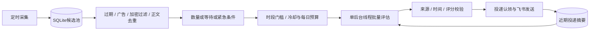

# Telegram News Monitor

从 Telegram 公开频道预览页采集新闻，经本地过滤与 CodeBuddy CLI 批量评估，将重要消息发送到飞书。无需 Telegram 账号或 Bot Token；公开页面仍可能限流、不可访问或改变结构。

适合个人或小团队的全球突发、宏观、军事和 AI 文字快讯筛选。完整分析见历史基线 [中文评估报告](REVIEW_REPORT.zh-CN.md)（对应提交 `76f7aeb9`，不是当前行为说明），推荐起步参数见 [均衡配置示例](monitor-tuning.env.example)（示例值 ≠ 代码默认值）。

## 更新内容

- **采集与模型解耦**：守护进程继续采集，一个后台线程负责评估与推送，最多运行一个评估任务。
- **调用成本限制**：持久化最小调用间隔和每日**评估轮次**；默认每批20条、每条800字符。一轮预约会计入 `DIGEST_MAX_CALLS_PER_DAY`，该轮内 CLI 最多调用 2 次（主模型 + fallback）。CodeBuddy CLI 文本输出不提供 `usage.total_tokens`，失败后保留候选，冷却后再试。
- **分层去重**：频道/消息ID、规范化正文指纹、24小时投递记录，以及最近20条投递摘要供模型比较新增事实。新闻卡片在飞书发送前再做一次**确定性近重复校验**（同组 24h 内 `title+summary` 与已投递摘要的实体/数字重合；`$6.06` 与 `$6` 视为同一量级）。同事件且未带实质更新（`is_update` + `update_reason` 中的新数字或新实体）则跳过发送、标 `near_duplicate`、不记为已投递。不额外调用模型。`wechat_photo` 不走此守卫。
- **旧闻拦截**：新闻路径在模型调用前和逐条推送前检查时间；默认频道发布时间和模型提取的事件时间均不得超过30分钟。缺失、无时区或明显未来时间不能作为新快讯。`wechat_photo` / `old_photos` 不走此闸门（内容匹配，不是时效）；`news_max_age_seconds: 0` 表示不限龄。
- **飞书卡片可读性**：单卡只展示「发布时间（北京时间）」；不展示页脚「事件时间」、不附带 `t.me` / 原文外链。摘要超过80字或超过2行时，在核心速览后追加「📌 事件详情」（优先模型要点，约3条）。晨报条目时间标为「北京时间：HH:MM」。
- **投资方向标签**：`bias_*` 仅允许利多/利空/中性/不确定，须与对应 `impact_*` 说明方向一致；有明确支撑/承压时不得默认中性或不确定。
- **不明投递避免重发**：主流程默认只尝试一次Webhook，提前记录投递认领；结果不明记为 `unknown`，不自动重试。
- **加密内容过滤**：模型调用前后过滤加密货币及区块链内容；规则仍可能误伤或漏网。
- **按组主题策略**：新闻组以 digest 提示词做主合规（宁可漏报）；可选的 `topic_filters.yaml` 只是按组本地正则安全网。词表不进代码仓库，部署时按组挂载策略文件。
- **北京时间弹性静默**：按 `Asia/Shanghai` 窗口调整评估门槛与飞书推送；采集仍全天运行。跨午夜窗口（如 `23:00-01:00`）按半开区间 `[start, end)` 解析。
- **微信公众号图片素材**：分组 id 是 `old_photos`，digest 提示词变体是 `wechat_photo`（不是两个产品）。与 `news24` 对等隔离。只收照片/相册，按**内容匹配**而不是时效；不拦截频道发布时间或 `event_at`。可按 `scrape_history_pages` 用 `?before=` 向更早预览页回填（有页预算，整页已入库则停；`scrape_history_max_new_posts` 可再限制每频道每轮新帖）。本地安全阀拒绝黄赌毒暴与时政敏感，`wechat_photo` 提示词宁缺毋滥；飞书卡只有标题、≤100 字说明和**最多 1 张**卡内嵌图（飞书应用上传 `image_key`；失败则回退为图片链接），无投资影响、无 Telegram/`t.me` 痕迹。每轮 digest 硬顶最多 2 条，多出的标 `wechat_digest_cap`。示例节奏（约 1 小时冷却、每日 8 次软顶）写在 `config.yaml.example`，不是全局代码默认。图片不送入模型，CodeBuddy token 不变。

语义去重和时间提取依赖模型，不能保证百分之百准确。严格时效可能漏掉时间不明的消息；进程崩溃或投递不明也可能漏推。当前没有完整持久化发件箱、PDF/OCR或独立研报摘要通道。夜间识别仍可能漏报或误报。

## 工作流程



正常候选满数量门槛或达到最长等待后评估。部分紧急关键词可提前触发，但不绕过冷却、预算和推送校验。超出批次上限的候选保留，紧急及较新候选优先；每批最多选5条，不要求凑数。选中消息按频道发布时间从早到晚发送，重要程度仅用于筛选；晨报内也按此顺序排列。排序仅保证同批次顺序，后续才采集到的消息仍可能晚到。

北京时间默认窗口（可改 `TIMEZONE` / `SHOULDER_HOURS` / `QUIET_HOURS`，空字符串关闭对应窗口）：

| 时段 | 本地时钟 | 评估 | 推送 |
|---|---|---|---|
| 白天 | 08:00–22:00 | 沿用 `DIGEST_*` / `HOTNESS_THRESHOLD` | 评分 ≥7 |
| 降频时段 | 22:00–00:00 | 16条或最长等待，最小间隔10分钟 | 评分 ≥8 |
| 深夜 | 00:00–08:00 | 普通候选等待30分钟再批量评估；紧急候选可按日间模型冷却提前评估 | 普通消息只保留；重大事件满足下述条件才即时提醒 |
| 夜间摘要 | 08:00起首次可用轮次，09:00前 | 共用模型预算和冷却；精选最多5个事件 | 合成一张卡片，每天最多一次，无重要内容不发送 |

采集全天继续。夜间重要候选存入 SQLite，超过实时新闻30分钟年龄仍可进入晨报；晨报只回顾当夜窗口，条目时间写「北京时间：HH:MM」（不附原文外链），不能冒充即时快讯。09:00后不补发迟到晨报。模型失败可在窗口内重试；发送结果不明不自动重发，重启也不会重复发送。

夜间打断必须同时满足：紧急关键词、明确评分≥9、模型标记 `night_alert=true`、正文包含与模型来源字段匹配的 Reuters/AP/AFP 或受支持官方域名。来源署名只是归因，不能替代独立核实。两次打断默认间隔30分钟，模型明确说明实质升级才可提前；每夜仍最多5张。普通名人观点不应打断。

晨报默认从最多20条候选中精选，候选优先级综合重要性和发布时间；模型合并同事件、保留输入中的最新进展。最终选出的最多5个事件按频道发布时间从早到晚排列。它不是完整夜间新闻档案，语义去重与事实更新时间仍依赖模型。夜间摘要缓存写入时清理三天前内容。


### 飞书卡片展示

- **单卡（日间/打断）**：标题、紧急档、发布时间（北京时间）、核心速览、关注建议。不展示页脚事件时间，不附带 Telegram / 原文外链。
- **投资影响**：仅当分组 `include_investment_impact=true`、紧迫度为 5 火（`score ≥ 9`），且分类为「军事」「地缘政治」或「宏观财经」时，才展示「💹 投资影响」四行（整体/美股/上证/大宗）。`old_photos` / wechat_photo 卡片始终不展示。
- **核心速览**：每条要点须把一件事讲清楚（主体+动作+结果/现状），简练完整，不以省略号收尾。
- **长讯**：要点较多时可在速览后追加「📌 事件详情」（优先 `summary_bullets`）。
- **夜间摘要（晨报）**：一张汇总卡，每条含标题、摘要（长讯同样可带事件详情）、关注点，时间统一写「北京时间：HH:MM」；不附原文外链，不当作即时快讯。
- **内部逻辑**：模型字段 `event_at` 仍用于旧闻拦截与夜间筛选，只是不再画到卡片上。

### 消息发送顺序

同一批次通过筛选的消息，按原始 Telegram 频道的 `published_at` 从早到晚发送。例如02:08和02:16的两条消息，会先发送02:08，再发送02:16。排序使用频道发布时间，不使用模型重要性排名、事件时间或采集时间；相同发布时间保持原有相对顺序。

重要程度仍控制是否入选和夜间是否允许打断，不决定选中消息的发送先后。新闻时效检查、去重、夜间静默与调用预算继续生效。跨批次不保证全局时间顺序：若较早发布的消息后来才采集到，它仍可能晚于已发送消息出现。此行为默认启用，无需新增配置；更新代码并重启进程或重建容器即可生效。

频道仍依次抓取，网络异常会拖长采集轮次。新闻组默认只看最新预览页；`old_photos` 可按页预算用 `?before=` 回填更早内容，仍受页数和软顶限制。建议单实例运行并持久化数据库。

## 快速开始

需要 Python 3.10+，网络能访问 Telegram 公开页面、CodeBuddy（国内站）和飞书。本地非 Docker 运行还需 Node.js，并安装 `@tencent-ai/codebuddy-code@2.149.0`（`codebuddy` 在 PATH 上）。Docker 镜像已内置该 CLI。

```bash
git clone https://github.com/bazz1111/tg_news_monitor.git
cd tg_news_monitor
python -m venv .venv
source .venv/bin/activate
python -m pip install -e ".[dev]"
cp .env.example .env
```

Windows PowerShell 使用 `.venv/Scripts/Activate.ps1` 激活环境，使用 `Copy-Item .env.example .env` 复制配置。

编辑 `.env`，填写自己的频道和凭据：

```dotenv
TELEGRAM_CHANNELS=zaobaosg,cnalatest,solidot
CODEBUDDY_API_KEY=your-api-key
CODEBUDDY_MODEL=deepseek-v4.1-flash
CODEBUDDY_FALLBACK_MODEL=hy3
CODEBUDDY_EFFORT=max
CODEBUDDY_AUTOCOMPACT=auto
CODEBUDDY_TIMEOUT=300
FEISHU_WEBHOOK_URL=https://open.feishu.cn/open-apis/bot/v2/hook/your-bot-id
FEISHU_WEBHOOK_SECRET=
DB_PATH=data/tg_news.db
```

`CODEBUDDY_API_KEY` 是 CodeBuddy CLI 凭据。主模型默认 `deepseek-v4.1-flash`（免费档），失败后重试 `hy3`（套餐标注 credits x0.00），两次都失败再走本地启发式。CLI 质量旋钮默认 `--effort max`、`--autocompact auto`（跟随模型上下文窗口），子进程超时默认 `CODEBUDDY_TIMEOUT=300` 秒；digest 评估使用 `max(300, timeout)`。不要设置 `CODEBUDDY_INTERNET_ENVIRONMENT`（会切到国际站）。不要提交真实凭据。将 [均衡配置片段](monitor-tuning.env.example) 合并进现有 `.env`，保留频道、凭据和数据库路径。

```bash
python -m tg_news_monitor.main --init-db
python -m tg_news_monitor.main --once
python -m tg_news_monitor.main
```

`--once` 会实际采集，并在门槛满足时调用模型和推送，并非 dry run。门槛未满足时只保留候选。最后一条命令持续运行，才能获得采集与评估解耦的效果。

## 配置

优先级：显式程序参数 → OS/容器环境变量 → `.env` → YAML/JSON → 代码默认值。更新代码不会覆盖旧环境变量或自动采用推荐参数。

### 对等 Group（多组）

多个 Group **彼此对等**，没有运行时特权「默认组」。每个 Group 是独立的公开频道采集 → 评估 → 飞书投递管道，有自己的频道列表和飞书 webhook。单进程 / 单容器按 tick 依次处理各组，**一次 LLM 调用不会混入其他组的帖子**。

守护进程里采集跑在主线程、评估/发送跑在后台线程：采集只按 `group_id` 写入 SQLite，**不会**切换当前组的 webhook、卡片样式或 prompt。评估与发送在该组的快照上下文中完成（webhook、card profile、policy、quiet、`prompt_variant`），并行采集即使调用 `_activate_group` 也不能把 news24 的卡片发到 `old_photos`。`old_photos` / `wechat_photo` 发送前还会硬拒绝新闻/能源/冲突类条目以及没有 `media_urls` 的卡片。

频道在各组之间互斥：同一频道不能出现在两个 Group（含 disabled）。启动时校验：Group `id` 唯一、启用且非空的 Group 必须能解析 webhook、全局频道不重复。

推荐把组写在 `config.yaml`（见 [config.yaml.example](config.yaml.example)），webhook 用环境变量名引用，避免把密钥写进 YAML：

```yaml
groups:
  - id: news24
    name: 7x24 新闻
    channels: [zaobaosg, cnalatest, solidot]
    webhook_url_env: FEISHU_WEBHOOK_NEWS24
    webhook_secret_env: FEISHU_WEBHOOK_SECRET_NEWS24
    # 可选覆盖（未写则沿用全局 DIGEST_* / QUIET_* / HOTNESS_*）
    hotness_threshold: 7
    digest_min_candidates: 12
    digest_max_calls_per_day: 120   # 本组软上限；全局 DIGEST_MAX_CALLS_PER_DAY 仍是硬顶
    card_profile:
      subtitle: 投资情报快报
      include_investment_impact: true
      prompt_variant: news          # news | story | wechat_photo
      # prompt_overlay: "额外系统提示"
      # embed_images: true          # 预留；目前仅 wechat_photo 发送路径会上传嵌入
  - id: old_photos
    name: 公众号历史图片素材
    channels:
      - ussrpictures
      - pfff_history
      - whichtimes
      - old_history_photos
      - historicalpictures
      - record_history
      - Discoveryzhongwen
      - sovietvisuals
      - fengls7                     # 中国历史影像；见下方说明
    webhook_url_env: FEISHU_WEBHOOK_OLD_PHOTOS
    quiet_hours: ""
    shoulder_hours: ""
    morning_flush_enabled: false
    news_max_age_seconds: 0         # 0 = 不限龄；wechat_photo 也会跳过发布时间闸门
    scrape_history_pages: 10        # 用 ?before= 向更早页翻；默认新闻组仍是 1 页
    scrape_history_max_new_posts: 40
    digest_min_candidates: 2
    digest_max_wait_seconds: 7200
    digest_min_interval_seconds: 3600
    digest_max_calls_per_day: 8
    card_profile:
      subtitle: 公众号图片素材
      include_investment_impact: false
      prompt_variant: wechat_photo
      embed_images: true            # wechat_photo 默认 true；需 FEISHU_APP_ID/SECRET
  - id: xhs_hot
    name: 小红书热点（示例，先空着）
    enabled: false
    channels: []
    webhook_url_env: FEISHU_WEBHOOK_XHS
    card_profile:
      subtitle: 故事速览
      include_investment_impact: false
      prompt_variant: story
```

`.env` 里只放密钥和全局 CodeBuddy 设置：

```dotenv
FEISHU_WEBHOOK_NEWS24=https://open.feishu.cn/open-apis/bot/v2/hook/...
FEISHU_WEBHOOK_SECRET_NEWS24=
# FEISHU_WEBHOOK_OLD_PHOTOS=
# FEISHU_WEBHOOK_XHS=
CODEBUDDY_API_KEY=...
CODEBUDDY_MODEL=deepseek-v4.1-flash
CODEBUDDY_FALLBACK_MODEL=hy3
CODEBUDDY_EFFORT=max
CODEBUDDY_AUTOCOMPACT=auto
CODEBUDDY_TIMEOUT=300
# 卡内嵌图（old_photos / wechat_photo）。自定义机器人 webhook 不能按 URL 嵌图，
# 需开放平台应用上传拿 image_key。不增加 LLM token。
# FEISHU_APP_ID=cli_xxx
# FEISHU_APP_SECRET=
```

#### `old_photos`：微信公众号历史影像素材

这是材料台，不是新闻快讯：公开 TG 频道只作进料，飞书是审稿箱，人工再发公众号。与 `news24` 分组隔离（独立 pending、模型批次、webhook、去重），互不影响。进料现含中国历史影像频道 `fengls7`（历史光影档案馆，`t.me/s/fengls7` 可预览照片）。专门做中国陵墓/宫殿/遗址的公开 TG 频道很少，这类素材大多在微博等平台。

| 步骤 | 行为 |
|---|---|
| 进料 | 仅 `has_media` 且 `media_type` 为 `photo`/`album`、且 `media_urls` 非空。纯文字、纯视频丢掉。短说明不因字数不够被当成垃圾。默认按 `scrape_history_pages`（示例 10）在最新预览页之后用 `?before=<本页最旧 message_id>` 向更早页翻；一页没有新未处理帖或空页则停，可用 `scrape_history_max_new_posts` 做每频道每轮软顶。新闻组默认仍只抓最新一页。 |
| 本地硬过滤 | 黄赌毒、血腥暴力、领导人/党宣、当代地缘鼓动、以及新闻/能源/冲突类（如「原油」「美伊」「冲突」、分类「能源」）直接拒绝，宁错杀。过不了的不进模型；发送前再拦一次，且必须有可点击图片 URL。 |
| 模型 | `prompt_variant: wechat_photo`，比 `story` 更严：只要适合大陆公众号的历史/文化静帧；无把握不选；每轮最多 0–2 条，不用同主题照片凑数。 |
| 说明 | 模型写中文完整句，≤100 字，不以省略号收尾，无时政评论；发送前再截断一次。 |
| 飞书卡 | 标题 + 说明 + **卡内嵌图 1 张**（只取第一条可展示 URL / 第一个 `image_key`；发送前把该 http(s) 图下载并 `POST /im/v1/images` 上传）。失败或未配置 `FEISHU_APP_ID`/`FEISHU_APP_SECRET` 时回退为可点击图片链接。**无**投资影响、**无**频道名/`t.me`/原文。图片只在发卡时上传，**不**送进 CodeBuddy。每轮 sanitize 后硬顶 ≤2 条，多出的标 `wechat_digest_cap`。 |
| 节奏 | 非实时、看内容匹配。默认 `digest_min_interval_seconds=3600`、`digest_max_calls_per_day=8`、`digest_min_candidates=2`、`digest_max_wait_seconds=7200`。`wechat_photo` **不**用频道 `published_at` 或 `event_at` 做时效拦截（`news24` 仍拦截）。`news_max_age_seconds: 0` 表示不限龄，可与显式 wechat 跳过同时用。关闭 `quiet_hours` / 晨报。频率可以后再调组级旋钮。 |

历史影像本身可以很旧，因此该组按内容适合度筛选，不用发布时间卡候选或发卡（`news24` 的 30 分钟时效不变）。图片像素不做识别，只能靠说明文字与模型。启用嵌图：在 `.env` 设置 `FEISHU_APP_ID` / `FEISHU_APP_SECRET`（`wechat_photo` 的 `embed_images` 默认为 true）。关掉嵌图可在该组 `card_profile.embed_images: false`，卡片会继续用 markdown 链接。

**从 `TELEGRAM_CHANNELS` 迁移：** 若配置里**没有** `groups` 字段，但存在旧的 `TELEGRAM_CHANNELS` + `FEISHU_WEBHOOK_URL`，启动时会合成一个对等 Group（默认 `id: legacy`，可用 `legacy_group_id` 改名）。这不是运行时特权默认组，只是兼容现有部署。一旦 YAML/配置里出现 `groups`，就不再把旧的单一频道列表当主数据源。升级后已有 SQLite 行会标上该 legacy id；若希望旧 pending/认领接到 `news24`，把该组 `id` 设为 `legacy`，或设 `legacy_group_id: news24` 后再迁库。

可选 per-group 覆盖（现在就生效，不是后期）：`quiet_hours` / `shoulder_hours`（写成 `""` 表示本组关闭这些窗口，不继承全局；省略字段才继承）、各档 `hotness_threshold`、digest 门槛/间隔/卡片间隔、`quiet_card_cap`、晨报开关与门槛、`digest_max_calls_per_day`（软）、`news_max_age_seconds`（`0` = 不限龄）、`scrape_history_pages` / `scrape_history_max_new_posts`、`card_profile`（`prompt_variant`：`news` / `story` / `wechat_photo`；`embed_images`：wechat_photo 默认 true）、`enabled`。空频道或 `enabled: false` 的组会被跳过。

存储与去重按 `group_id` 隔离：帖子唯一键为 `(group_id, channel, message_id)`，投递指纹与晨报/静默认领也按组分开。同一正文可以分别推到两个组的 webhook。日志带 `group=<id>`。

Docker 若使用 `config.yaml`，把它挂进容器并设置 `CONFIG_PATH`，例如 `./config.yaml:/app/config.yaml:ro`。

### 按组主题策略文件

复制 [topic_filters.yaml.example](topic_filters.yaml.example) 为 `topic_filters.yaml`（已 gitignore）。按 `groups.<id>` 填写各组策略；缺组走 `default`；缺文件或 `enabled: false` 则主题过滤关闭（广告/加密过滤仍生效）。部署时与 `config.yaml` 一样只读挂载，并用 `TOPIC_FILTERS_PATH` 或配置项 `topic_filters_path` 指向该文件。不要把生产词表写进仓库或贴进 PR。

| 变量 | 代码默认 | 均衡建议 | 说明 |
|---|---:|---:|---|
| `POLL_INTERVAL_SECONDS` | 60 | 60 | 采集周期，秒，不等于模型周期 |
| `MAX_JITTER_SECONDS` | 15 | 10 | 采集抖动参数，秒 |
| `INTER_CHANNEL_DELAY_SECONDS` | 2 | 2 | 相邻频道间隔，秒 |
| `DIGEST_MIN_CANDIDATES` | 3 | 12 | 去重及过滤后的数量门槛 |
| `DIGEST_MAX_WAIT_SECONDS` | 900 | 600 | 正常最长等待，秒，仍受预算与冷却限制 |
| `DIGEST_MIN_INTERVAL_SECONDS` | 180 | 180 | 模型最小间隔，秒，重启后仍有效 |
| `DIGEST_MAX_BATCH_SIZE` | 20 | 20 | 每批上限，可配置1–50 |
| `DIGEST_MAX_CALLS_PER_DAY` | 288 | 288 | 每UTC日**评估轮次**上限（失败也计数）；每轮 CLI 最多 2 次（主模型+fallback） |
| `NEWS_MAX_AGE_SECONDS` | 1800 | 1800 | 频道与事件时间最大年龄，秒 |
| `HOTNESS_THRESHOLD` | 7 | 7 | 推送评分下限，1–10 |
| `DIGEST_CARD_INTERVAL_SECONDS` | 10 | 10 | 同批卡片间隔，秒 |
| `TIMEZONE` | `Asia/Shanghai` | `Asia/Shanghai` | 静默窗口时区 |
| `SHOULDER_HOURS` | `22:00-00:00` | `22:00-00:00` | 肩时段，可跨午夜；空=关闭 |
| `QUIET_HOURS` | `00:00-08:00` | `00:00-08:00` | 深夜窗口；空=关闭 |
| `SHOULDER_HOTNESS_THRESHOLD` | 8 | 8 | 肩时段推送评分下限 |
| `SHOULDER_DIGEST_MIN_INTERVAL_SECONDS` | 600 | 600 | 肩时段模型最小间隔，秒 |
| `SHOULDER_DIGEST_MIN_CANDIDATES` | 16 | 16 | 肩时段数量门槛 |
| `SHOULDER_DIGEST_CARD_INTERVAL_SECONDS` | 15 | 15 | 肩时段同批卡片间隔，秒 |
| `QUIET_HOTNESS_THRESHOLD` | 9 | 9 | 深夜推送评分下限，实际至少9分，关键词不可绕过 |
| `QUIET_DIGEST_MIN_INTERVAL_SECONDS` | 1800 | 1800 | 深夜普通模型等待及最小间隔，秒 |
| `QUIET_ALERT_INTERVAL_SECONDS` | 1800 | 1800 | 夜间即时提醒最小间隔，实质升级可提前 |
| `MORNING_FLUSH_ENABLED` | true | true | 开启单条夜间摘要 |
| `QUIET_CARD_CAP` | 5 | 5 | 单个深夜窗口飞书卡片上限 |
| `MORNING_FLUSH_HOTNESS_THRESHOLD` | 7 | 7 | 夜间摘要评分下限 |
| `DB_PATH` | `data/tg_news.db` | 持久化路径 | SQLite文件 |
| `LOG_LEVEL` | `INFO` | `INFO` | 日志等级 |
| `CODEBUDDY_MODEL` | `deepseek-v4.1-flash` | `deepseek-v4.1-flash` | 主模型，CLI `--model` |
| `CODEBUDDY_FALLBACK_MODEL` | `hy3` | `hy3` | 主模型失败后的回退模型 |
| `CODEBUDDY_EFFORT` | `max` | `max` | CLI `--effort`（minimal\|low\|medium\|high\|xhigh\|max） |
| `CODEBUDDY_AUTOCOMPACT` | `auto` | `auto` | CLI `--autocompact`，跟随模型上下文窗口 |
| `CODEBUDDY_TIMEOUT` | 300 | 300 | CLI 子进程超时秒数；digest 使用 `max(300, timeout)` |

`QUIET_*` / `SHOULDER_*` / `MORNING_FLUSH_*` 仍控制对应窗口的门槛、间隔、卡片上限与晨报评分。`QUIET_DIGEST_MIN_CANDIDATES`、`MORNING_FLUSH_MAX_AGE_SECONDS`、`MORNING_FLUSH_CARD_INTERVAL_SECONDS` 仍生效。已有部署需同步更新旧窗口环境变量，再重启进程。

`TELEGRAM_CHANNELS` 默认空。CodeBuddy 和飞书凭据自行填写，签名密钥 `FEISHU_WEBHOOK_SECRET` 可选。`old_photos` 卡内嵌图还需 `FEISHU_APP_ID` 与 `FEISHU_APP_SECRET`（开放平台应用，具备上传图片权限）。代理建议通过OS/容器的 `HTTP_PROXY`、`HTTPS_PROXY` 设置，不要假设仅写入YAML的代理字段会传给HTTP客户端。容器内 `codebuddy` 装在 `/usr/local/bin`，非 root `appuser` 可直接调用；不要在镜像或 `.env` 里设置 `CODEBUDDY_INTERNET_ENVIRONMENT`。

### 时效与成本

建议从每分钟采集、模型最短3分钟、普通新闻最长等待10分钟开始，观察三天实际流量再调整。紧急消息约3–5分钟是正常负载目标，不是SLA；未识别为紧急的单条消息可能等10分钟，还需加上网络和模型耗时。22:00后门槛抬高，00:00–08:00普通消息静默，08:00起生成一次夜间摘要。

持续每3分钟调用一次需要480次/天；288次预算在满负荷下约14.4小时耗尽。预算耗尽后继续采集，停止模型调用，过期消息过滤，不在次日补发。较低预算与全天高时效不能无条件兼得。

每日限制是**评估轮次，不是精确 token 总量，也不是 CLI 进程次数**。一轮预约最多打主模型 + fallback 各一次；把上限理解成「CLI 次数」会把日预算算紧一倍。输入有批次及字符限制；CodeBuddy CLI `--output-format text` 通常不回传 token 用量，`digest_calls.tokens` 多为未知，不能按零费用计算，以服务商账单为准。

## Docker 部署和升级

准备好 `.env` 后：

```bash
docker compose up -d --build
docker compose logs -f
docker compose down
```

Compose挂载 `./data:/app/data`，数据库为 `/app/data/tg_news.db`。现有配置使用 `network_mode: host`，请根据部署平台和网络调整，不是所有环境都需要主机网络。镜像内以 root 安装 Node 20 与 `@tencent-ai/codebuddy-code@2.149.0`，二进制在 `/usr/local/bin/codebuddy`，`appuser` 可直接执行。

升级前停止旧实例并一致性备份数据库及配置，再更新代码、合并参数、重建镜像。新增 `digest_calls`、`delivery_claims` 、`alert_schedule_state`、`night_candidates`、`morning_reports` 和 `night_alerts` 表在runner启动时自动创建。多组升级会给上述表和 `posts` 补上 `group_id`（旧行标为 `legacy` 或 `legacy_group_id`）。不要删库重置预算、去重和夜间卡片计数。

新投递历史从升级后记录，不自动迁移旧版已发送摘要；原消息ID去重保留。当前建议单实例运行。回滚旧代码后新保护不再生效。容器 `HEALTHCHECK` 调用 `python -m tg_news_monitor.main --healthcheck`，检查 SQLite 里最近的采集/评估心跳（过期或缺失则非零退出）。Compose 的 `restart: unless-stopped` **不会**仅因 unhealthy 自动重建容器；若要按健康状态拉起，需额外的 autoheal 边车或编排器探针。`stop_grace_period: 90s` 给评估线程收尾时间；内存上限 `mem_limit` / `memswap_limit` 为 1g。

## 常见情况

- **不推送**：检查抓取成功率、门槛、冷却、预算、年龄、评分及当前北京时间窗口，并非每条帖子都会推送。深夜默认几乎不推，除非同时满足重大事件打断条件，且受每夜5张卡片限制。
- **新转发旧事件**：频道时间不是事件时间；无法确认 `event_at` 时不即时推送，模型误判仍可能放过旧闻。
- **改写后的重复**：正文指纹只处理规范化后相同的正文。新闻路径在发送前用模板剥离后的中文二元组 + 数字桶做近重复拦截（Jaccard ≥0.45 且至少 1 个非套话重合，或 Jaccard ≥0.30 且 ≥4 个实体重合）；仅改标题、补加州/创纪录、`$6`→`$6.06` 会被挡住。模型仍可能把同事件选进 digest，但飞书不会发出第二张。真正不同的宏观事件（如柴油 vs 美联储）不受影响。`wechat_photo` / 分组隔离不变。
- **投递不明**：查 `delivery_claims.status='unknown'`，默认不自动重试。避免重复与保证必达存在取舍。
- **研报未推送**：当前只处理文字快讯，没有PDF/OCR或独立研究摘要通道，严格30分钟门槛可能过滤研究内容。

可用SQLite查看调用及不明投递：

```sql
SELECT date(started, 'unixepoch') AS utc_day,
       count(*) AS calls, sum(tokens) AS known_tokens,
       sum(tokens IS NULL) AS unknown_usage_calls
FROM digest_calls GROUP BY utc_day ORDER BY utc_day DESC;

SELECT datetime(claimed, 'unixepoch') AS utc_time, summary
FROM delivery_claims WHERE status='unknown' ORDER BY claimed DESC;
```

投递记录为约24小时去重窗口，不是长期审计日志。

## 测试与CLI

```bash
python -m pytest -q
python -m tg_news_monitor.main --help
```

支持 `--once`、`--init-db`、`--config PATH`、`--healthcheck`、`--version`。`--config` 仅当后缀恰好是 `.env` 时按 dotenv 加载（`environment.yaml` 不会被当成 env）。使用模拟服务，不代表线上语义判断、费用和飞书可用性已验证。

生产镜像只装 runtime 依赖（`requirements.txt` / `pip install .`）。pytest 在 `[dev]` extra。许可证为 MIT，见 [LICENSE](LICENSE)。

## License

MIT License.
