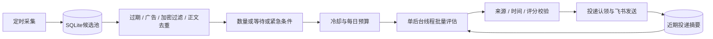

# Telegram News Monitor

从 Telegram 公开频道预览页采集新闻，经本地过滤与 DeepSeek 批量评估，将重要消息发送到飞书。无需 Telegram 账号或 Bot Token；公开页面仍可能限流、不可访问或改变结构。

适合个人或小团队的全球突发、宏观、军事和 AI 文字快讯筛选。完整分析见 [中文评估报告](REVIEW_REPORT.zh-CN.md)，推荐参数见 [均衡配置](monitor-tuning.env.example)。

## 更新内容

- **采集与模型解耦**：守护进程继续采集，一个后台线程负责评估与推送，最多运行一个评估任务。
- **调用成本限制**：持久化最小调用间隔和每日次数；默认每批20条、每条800字符，输出最多3000 tokens。模型失败保留候选，冷却后再试。
- **分层去重**：频道/消息ID、规范化正文指纹、24小时投递记录，以及最近20条投递摘要供模型比较新增事实。
- **旧闻拦截**：模型调用前和逐条推送前检查时间；默认频道发布时间和模型提取的事件时间均不得超过30分钟。缺失、无时区或明显未来时间不能作为新快讯。
- **来源可追溯**：每条新闻单独发卡片，展示频道发布时间、事件时间及原文链接，区分事实与模型解读。
- **不明投递避免重发**：主流程默认只尝试一次Webhook，提前记录投递认领；结果不明记为 `unknown`，不自动重试。
- **加密内容过滤**：模型调用前后过滤加密货币及区块链内容；规则仍可能误伤或漏网。

语义去重和时间提取依赖模型，不能保证百分之百准确。严格时效可能漏掉时间不明的消息；进程崩溃或投递不明也可能漏推。当前没有完整持久化发件箱、PDF/OCR或独立研报摘要通道。

## 工作流程



正常候选满数量门槛或达到最长等待后评估。部分紧急关键词可提前触发，但不绕过冷却、预算和推送校验。超出批次上限的候选保留，紧急及较新候选优先；每批最多选5条，不要求凑数。

频道仍依次抓取，网络异常会拖长采集轮次；公开页面窗口外的消息不保证补采。建议单实例运行并持久化数据库。

## 快速开始

需要 Python 3.10+，网络能访问 Telegram 公开页面、DeepSeek 和飞书。

```bash
git clone https://github.com/bazz1111/tg_news_monitor.git
cd tg_news_monitor
python -m venv .venv
source .venv/bin/activate
python -m pip install -e ".[dev]"
cp .env.example .env
```

Windows PowerShell 使用 `.venv/Scripts/Activate.ps1` 激活环境，使用 `Copy-Item .env.example .env` 复制配置。

编辑 `.env`，填写自己的频道和凭据：

```dotenv
TELEGRAM_CHANNELS=zaobaosg,cnalatest,solidot
DEEPSEEK_API_KEY=your-api-key
DEEPSEEK_API_BASE=https://api.deepseek.com
DEEPSEEK_MODEL=deepseek-chat
FEISHU_WEBHOOK_URL=https://open.feishu.cn/open-apis/bot/v2/hook/your-bot-id
FEISHU_WEBHOOK_SECRET=
DB_PATH=data/tg_news.db
```

模型名按账户可用模型配置。`deepseek-chat` 是代码默认值，原配置模板可能使用其他名称。不要提交真实凭据。将 [均衡配置片段](monitor-tuning.env.example) 合并进现有 `.env`，保留频道、凭据和数据库路径。

```bash
python -m tg_news_monitor.main --init-db
python -m tg_news_monitor.main --once
python -m tg_news_monitor.main
```

`--once` 会实际采集，并在门槛满足时调用模型和推送，并非 dry run。门槛未满足时只保留候选。最后一条命令持续运行，才能获得采集与评估解耦的效果。

## 配置

优先级：显式程序参数 → OS/容器环境变量 → `.env` → YAML/JSON → 代码默认值。更新代码不会覆盖旧环境变量或自动采用推荐参数。

| 变量 | 代码默认 | 均衡建议 | 说明 |
|---|---:|---:|---|
| `POLL_INTERVAL_SECONDS` | 60 | 60 | 采集周期，秒，不等于模型周期 |
| `MAX_JITTER_SECONDS` | 15 | 10 | 采集抖动参数，秒 |
| `INTER_CHANNEL_DELAY_SECONDS` | 2 | 2 | 相邻频道间隔，秒 |
| `DIGEST_MIN_CANDIDATES` | 3 | 12 | 去重及过滤后的数量门槛 |
| `DIGEST_MAX_WAIT_SECONDS` | 900 | 600 | 正常最长等待，秒，仍受预算与冷却限制 |
| `DIGEST_MIN_INTERVAL_SECONDS` | 180 | 180 | 模型最小间隔，秒，重启后仍有效 |
| `DIGEST_MAX_BATCH_SIZE` | 20 | 20 | 每批上限，可配置1–50 |
| `DIGEST_MAX_CALLS_PER_DAY` | 288 | 288 | 每UTC日调用预约上限，失败也计数 |
| `NEWS_MAX_AGE_SECONDS` | 1800 | 1800 | 频道与事件时间最大年龄，秒 |
| `HOTNESS_THRESHOLD` | 7 | 7 | 推送评分下限，1–10 |
| `DIGEST_CARD_INTERVAL_SECONDS` | 10 | 2 | 同批卡片间隔，秒 |
| `DB_PATH` | `data/tg_news.db` | 持久化路径 | SQLite文件 |
| `LOG_LEVEL` | `INFO` | `INFO` | 日志等级 |

`TELEGRAM_CHANNELS` 默认空。DeepSeek和飞书凭据自行填写，签名密钥 `FEISHU_WEBHOOK_SECRET` 可选。代理建议通过OS/容器的 `HTTP_PROXY`、`HTTPS_PROXY` 设置，不要假设仅写入YAML的代理字段会传给HTTP客户端。

### 时效与成本

建议从每分钟采集、模型最短3分钟、普通新闻最长等待10分钟开始，观察三天实际流量再调整。紧急消息约3–5分钟是正常负载目标，不是SLA；未识别为紧急的单条消息可能等10分钟，还需加上网络和模型耗时。

持续每3分钟调用一次需要480次/天；288次预算在满负荷下约14.4小时耗尽。预算耗尽后继续采集，停止模型调用，过期消息过滤，不在次日补发。较低预算与全天高时效不能无条件兼得。

每日限制是**调用次数，不是精确token总量**。输入有批次及字符限制，输出最多3000 tokens；实际用量记录在 `digest_calls.tokens`，未知用量不能按零费用计算，以服务商账单为准。

## Docker 部署和升级

准备好 `.env` 后：

```bash
docker compose up -d --build
docker compose logs -f
docker compose down
```

Compose挂载 `./data:/app/data`，数据库为 `/app/data/tg_news.db`。现有配置使用 `network_mode: host`，请根据部署平台和网络调整，不是所有环境都需要主机网络。

升级前停止旧实例并一致性备份数据库及配置，再更新代码、合并参数、重建镜像。新增 `digest_calls` 和 `delivery_claims` 表在runner启动时自动创建。不要删库重置预算和去重记录。

新投递历史从升级后记录，不自动迁移旧版已发送摘要；原消息ID去重保留。当前建议单实例运行。回滚旧代码后新保护不再生效。容器健康检查仅检查CLI能运行，不能证明采集、模型或推送正常。

## 常见情况

- **不推送**：检查抓取成功率、门槛、冷却、预算、年龄及评分，并非每条帖子都会推送。
- **新转发旧事件**：频道时间不是事件时间；无法确认 `event_at` 时不即时推送，模型误判仍可能放过旧闻。
- **改写后的重复**：正文指纹只处理规范化后相同的正文；改写/跨语言比较依赖模型和24小时内最近20条摘要，每条最多300字符。
- **投递不明**：查 `delivery_claims.status='unknown'`，默认不自动重试。避免重复与保证必达存在取舍。
- **研报未推送**：当前只处理文字快讯，没有PDF/OCR或独立研究摘要通道，严格30分钟门槛可能过滤研究内容。

可用SQLite查看调用及不明投递：

```sql
SELECT date(started, 'unixepoch') AS utc_day,
       count(*) AS calls, sum(tokens) AS known_tokens,
       sum(tokens IS NULL) AS unknown_usage_calls
FROM digest_calls GROUP BY utc_day ORDER BY utc_day DESC;

SELECT datetime(claimed, 'unixepoch') AS utc_time, summary
FROM delivery_claims WHERE status='unknown' ORDER BY claimed DESC;
```

投递记录为约24小时去重窗口，不是长期审计日志。

## 测试与CLI

```bash
python -m pytest -q
python -m tg_news_monitor.main --help
```

支持 `--once`、`--init-db`、`--config PATH`、`--version`。本次修订本地140项测试通过；使用模拟服务，不代表线上语义判断、费用和飞书可用性已验证。

## License

MIT License.
